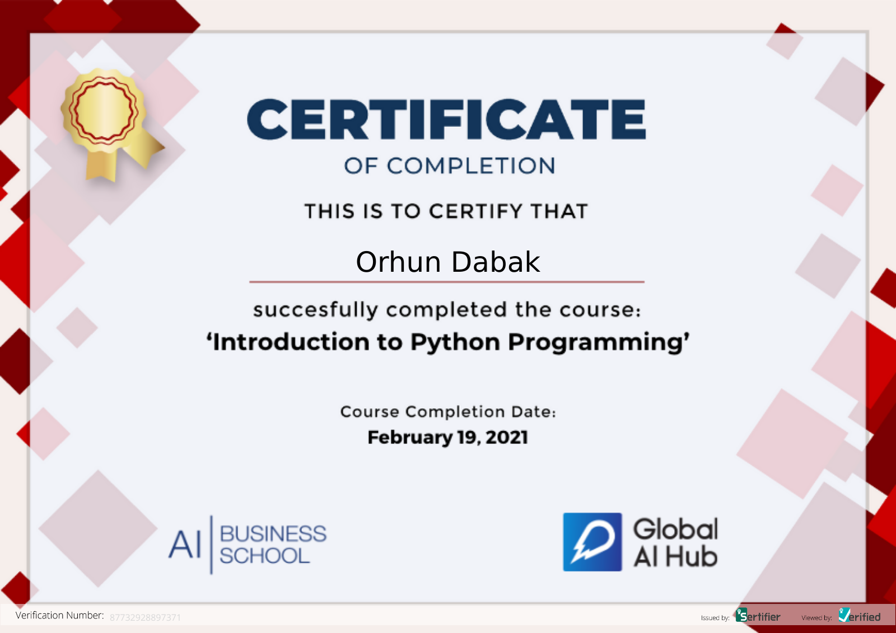

**Course Date:** 15.02.2021  
**Name:** Orhun  
**Surname:** Dabak 

**Email:** orhunn.dabak@hotmail.com

## Recipe Application
Enter 3 recipes. Create separate class for each recipe. İdentify the products using the init() method.
write a function about how much these products should be used later.

---

### Certification

